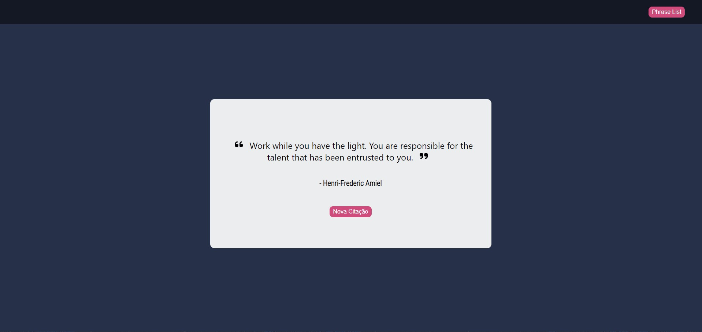
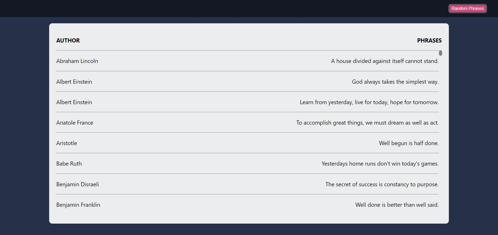

# Phrases API

Esse projeto foi contruído com intuito de teste meus conhecimentos em javascript, foi utilizado estruturação de componentes e o styled-components para estilziação.

É um página, sendo a principal onde pode se obter uma frase aleatória e clicando no botão "Phrases List" você pode visualizar a lista de todas frases disponíveis na api

     

 

     

 

     
    

  

## Linguagens Utilizadas

    

